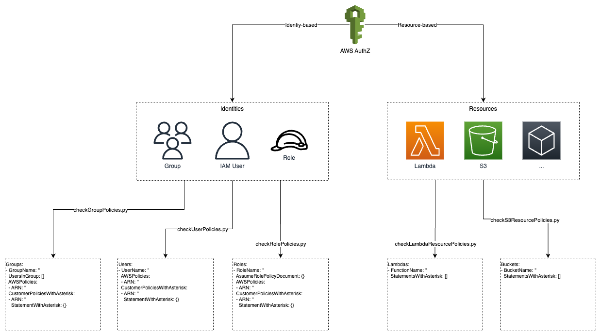

# aws-lambda-iam-audit

> This project is part of my software architecture journey. See my [software-architecture-journey](https://github.com/mykingdomforapawn/software-architecture-journey) repository for more details. 

This simple AWS solution aims to make it easier to analyze and audit the IAM setup of an account. Basically, a set of lambda functions can be used to return relevant information about the permission setup without having to navigate through the IAM service manually. This approach is a proof of concept and can be easily extended based on the specific requirements.

---

## Table of contents:
- [Big picture](#big-picture)
- [Get started](#get-started)
- [References](#references)

---

## Big picture
To give the project some structure, the analyzed entities are separated into two groups. On one side, there are the entities to which identity-based policies can be assigned, and on the other side, there are the entities to which resource-based policies can be assigned. A different lambda function can be used for each entity. Furthermore, the output structure of each function is shown. Keep in mind that this structure is very flexible and can be adapted freely.


## Get started

### Set up the environment
The project has been developed using the AWS SAM CLI. If you don't want that setup overhead, you can also use the .py files from the functions folder and set up the lambdas manually in the AWS Management Console.
- Install the AWS SAM CLI, Docker Desktop, and Python
- Set up a virtual environment and install the packages from the requirements_local_env.txt file
- Set up an IAM user in your AWS account with the appropriate permissions and link it to your IDE

### Build & deploy
- Run the build command to prepare the functions for deployment
```properties
sam build
```  
- Run the deploy command to make your lambdas available in your AWS account
```properties
sam deploy --guided
```
- Check out the [AWS SAM documentation](https://docs.aws.amazon.com/serverless-application-model/latest/developerguide/serverless-sam-cli-command-reference.html) for more details on the CLI commands

### Invoke lambda functions
- You can invoke your lambda functions locally with the following command
```properties
sam local invoke functionName -e events/events.json
```
- Although this does no make too much sense, because the functions need to access resources in your account, it is still good know
- Use the following command to invoke your functions remotely in your account
```properties
sam remote invoke functionName --stack-name stackName --event-file events/events.json | jq
```
- The functionName as well as the stackName depend on the parameters that you have set in the previous build and deployment steps
- You might have to install jq for a prettier output but you can also just invoke the function without the jq pipe

### Make changes
- If you want to make changes to the project, just edit the files in the functions and events folders or add new ones
- Make sure to update the templates.yaml as well
- Then run the following command to efficiently push your changes
```properties
sam build && sam deploy
```

### Clean up
- In order to clean up your AWS account, just run the following commands
- You might have to empty some S3 buckets before you can delete the stacks
```properties
sam delete --stack-name stackName
sam delete --stack-name aws-sam-cli-managed-default 
```
---

## References
- https://docs.aws.amazon.com/serverless-application-model/latest/developerguide/install-sam-cli.html
- https://travis.media/developing-aws-lambda-functions-locally-vscode/
- https://docs.aws.amazon.com/serverless-application-model/latest/developerguide/serverless-sam-cli-command-reference.html